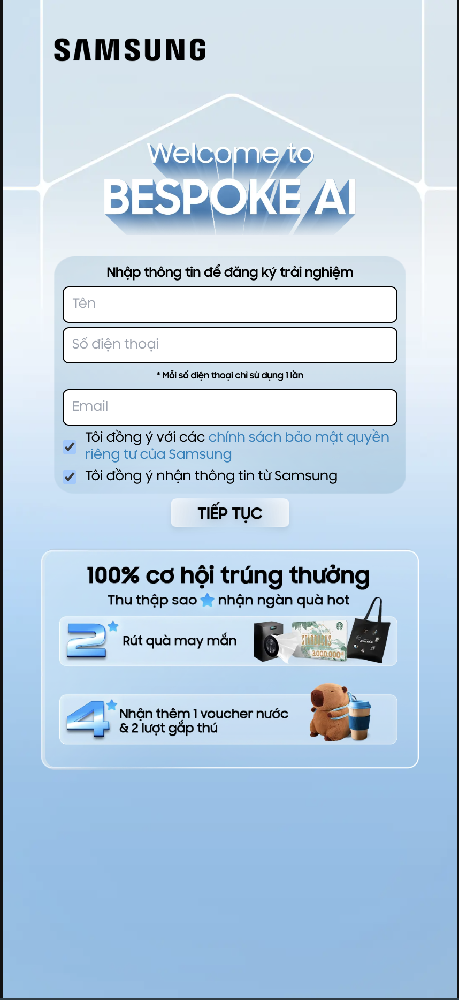
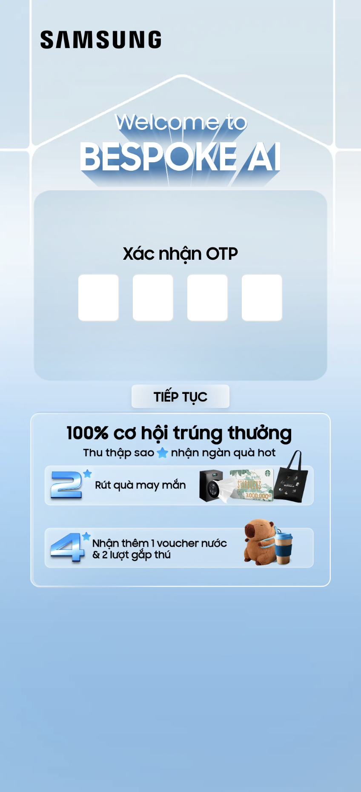
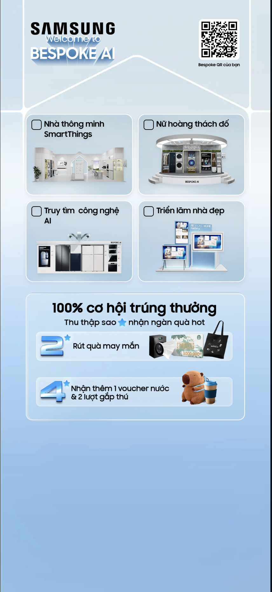
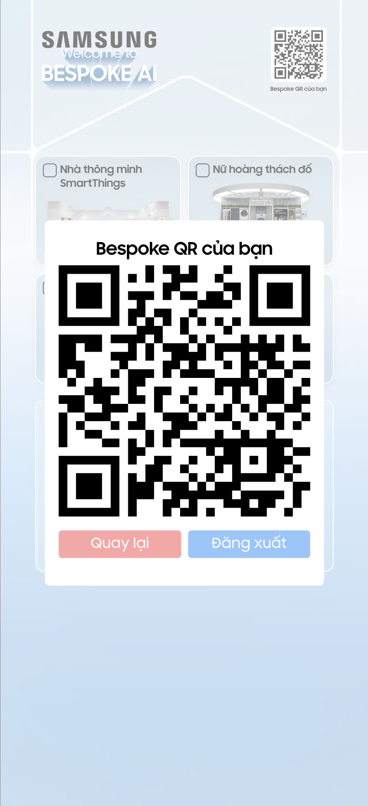
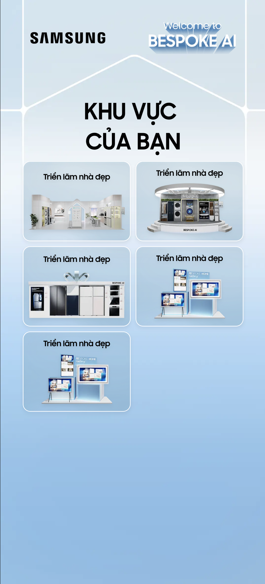

# Samsung Bespoke AI - Hệ Thống Đăng Ký Sự Kiện

Hệ thống đăng ký và quản lý khách hàng tham gia sự kiện Samsung Bespoke AI.

## Tính năng chính

- **Đăng ký khách hàng**: Đăng ký thông tin và xác thực OTP qua SMS
- **Theo dõi hành trình**: Theo dõi khách hàng qua 4 khu vực triển lãm
- **Quản lý quà tặng**: Đổi và nhận quà tặng tại sự kiện
- **CMS Nhân viên**: Giao diện cho nhân viên quét QR code check-in
- **Bảng điều khiển Admin**: Quản lý và xem thống kê khách hàng

## Công nghệ sử dụng

- **Framework**: Next.js 14 (App Router)
- **Cơ sở dữ liệu**: PostgreSQL + Prisma ORM
- **Giao diện**: Tailwind CSS + Radix UI
- **Xác thực**: JWT + Cookies
- **Form**: React Hook Form + Zod

## Hướng dẫn cài đặt

```bash
# Clone repo
git clone https://github.com/trivm09/samsungbespokeai.git
cd samsungbespokeai

# Cài đặt dependencies
npm install

# Tạo file .env từ template
cp .env.example .env

# Chạy migration và seed dữ liệu mẫu
npx prisma migrate dev
npx prisma db seed

# Khởi động server phát triển
npm run dev
```

## Cấu hình biến môi trường

```env
POSTGRES_PRISMA_URL=postgresql://...
POSTGRES_URL_NON_POOLING=postgresql://...
OTP_TOKEN=your_otp_token
JWT_SECRET=your_jwt_secret
```

## Cấu trúc thư mục

```
├── app/
│   ├── admin/          # Trang quản trị
│   ├── auth/           # Đăng nhập/xác thực
│   ├── cms/            # CMS nhân viên (quét QR)
│   ├── customer/       # Hành trình khách hàng
│   ├── api/            # API routes
│   └── actions/        # Server actions
├── components/
│   ├── custom-ui/      # Components tùy chỉnh
│   └── images-ui/      # Components hình ảnh
├── lib/
│   ├── client/         # Tiện ích phía client
│   └── server/         # Tiện ích phía server
└── prisma/
    └── schema.prisma   # Schema cơ sở dữ liệu
```

## Ảnh chụp màn hình

### Trang đăng ký


### Hành trình khách hàng




### CMS Nhân viên


